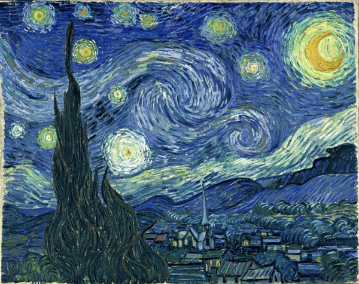
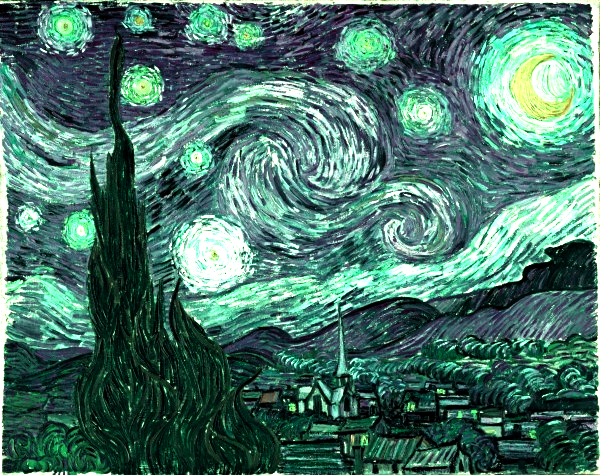

# Ex3: Color Transfer 算法实现色彩迁移

## 实验内容描述
> 实现论文 *Color transfer between images - Computer Graphics and Applications,IEEE* 中的**Color transfer**算法。

## 算法简述
- 输入：源图像src， 目标图像tar。 两者均为RGB图像。
- 将src和tar都转换成Lab空间的表现形式src_lab和tar_lab；在 Lab 空间中,L 是与图像的亮度有关,取值范围为[0, 100]的浮点数,表示从纯黑到纯白;
a 和 b 分别表示从红色到绿色的范围和从黄色到蓝色的范围,取值范围都是[-128, 127]。在Lab空间操作中可以分离亮度和色彩。
- 分别计算src_lab和tar_lab每个通道的均值和标准差，并算出两幅图对应标准差的比值。
- 新图像每个像素点的值等于：(src_lab-src_mean)×(tar_variance/src_variance)+tar_mean
- 最后将得到的Lab空间的图像转回RGB空间即可。

## 代码相关

- 语言：C/C++
- 第三方库：CImg.h

## 效果展示
- 输入图像 src.jpg  

- 输入图像 tar.jpg  

- 输出图像 out.jpg  

