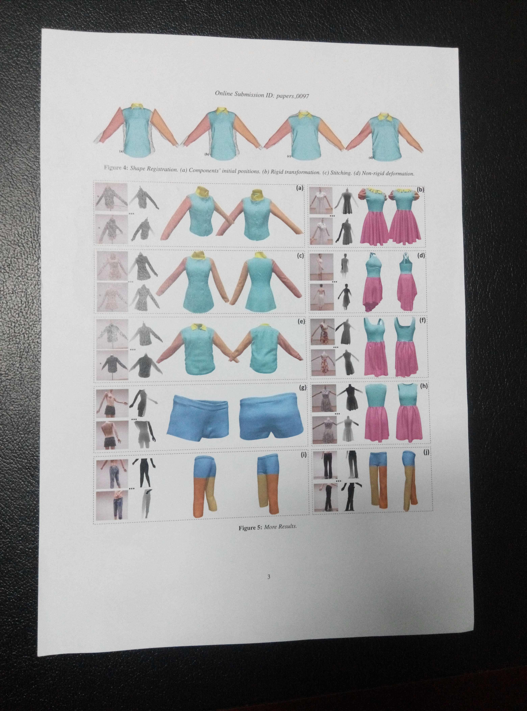
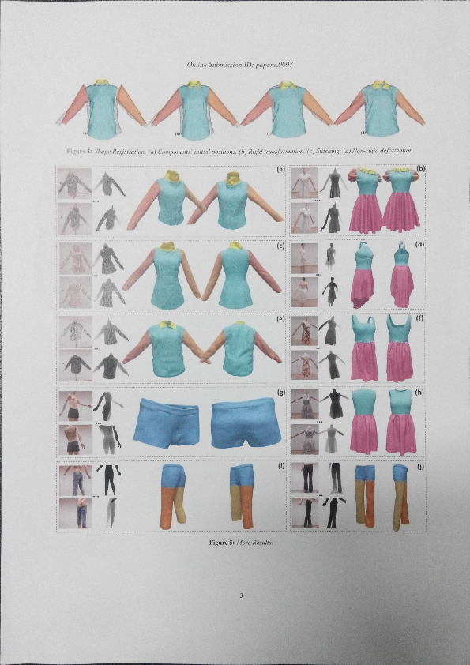

# Ex5: Perspective Transform 透视变换的应用：A4纸矫正

## 实验内容描述
> 把图像中的A4纸矫正成实际比例

## 算法简述
透视变换（Perspective Transform）

参考内容：http://blog.csdn.net/xiaowei_cqu/article/details/26471527

## 代码相关

- 语言：C/C++
- 第三方库：CImg.h

## 效果展示
- 输入图像 src.jpg

- 输出图像 out.jpg  

